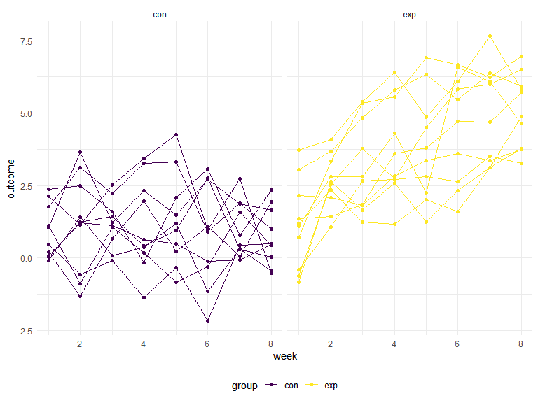
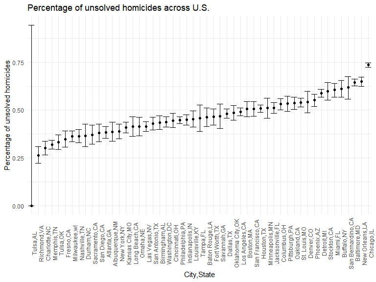
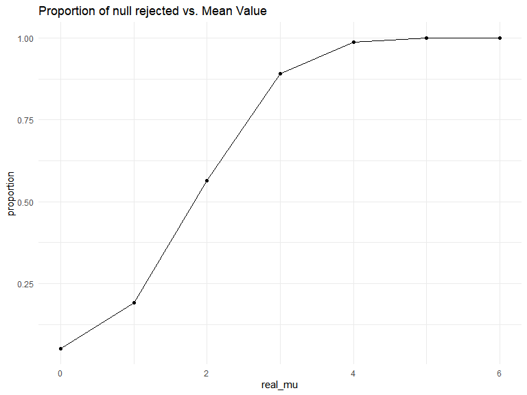
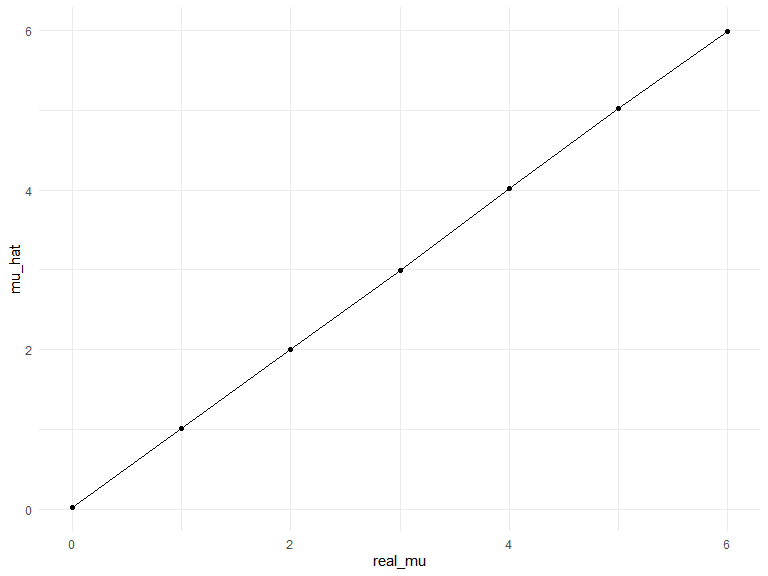
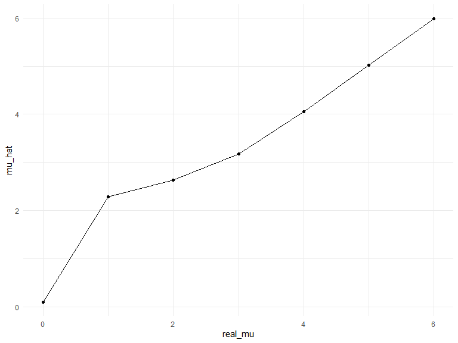

p8105_hw5_sl5232
================
Shangsi Lin
2022-11-16

## Problem 1

The code chunk below imports the data in individual spreadsheets
contained in `./data/zip_data/`. To do this, I create a dataframe that
includes the list of all files in that directory and the complete path
to each file. As a next step, I `map` over paths and import data using
the `read_csv` function. Finally, I `unnest` the result of `map`.

``` r
full_df = 
  tibble(
    files = list.files("data/zip_data/"),
    path = str_c("data/zip_data/", files)
  ) %>% 
  mutate(data = map(path, read_csv)) %>% 
  unnest()
```

    ## Rows: 1 Columns: 8
    ## ── Column specification ────────────────────────────────────────────────────────
    ## Delimiter: ","
    ## dbl (8): week_1, week_2, week_3, week_4, week_5, week_6, week_7, week_8
    ## 
    ## ℹ Use `spec()` to retrieve the full column specification for this data.
    ## ℹ Specify the column types or set `show_col_types = FALSE` to quiet this message.
    ## Rows: 1 Columns: 8
    ## ── Column specification ────────────────────────────────────────────────────────
    ## Delimiter: ","
    ## dbl (8): week_1, week_2, week_3, week_4, week_5, week_6, week_7, week_8
    ## 
    ## ℹ Use `spec()` to retrieve the full column specification for this data.
    ## ℹ Specify the column types or set `show_col_types = FALSE` to quiet this message.
    ## Rows: 1 Columns: 8
    ## ── Column specification ────────────────────────────────────────────────────────
    ## Delimiter: ","
    ## dbl (8): week_1, week_2, week_3, week_4, week_5, week_6, week_7, week_8
    ## 
    ## ℹ Use `spec()` to retrieve the full column specification for this data.
    ## ℹ Specify the column types or set `show_col_types = FALSE` to quiet this message.
    ## Rows: 1 Columns: 8
    ## ── Column specification ────────────────────────────────────────────────────────
    ## Delimiter: ","
    ## dbl (8): week_1, week_2, week_3, week_4, week_5, week_6, week_7, week_8
    ## 
    ## ℹ Use `spec()` to retrieve the full column specification for this data.
    ## ℹ Specify the column types or set `show_col_types = FALSE` to quiet this message.
    ## Rows: 1 Columns: 8
    ## ── Column specification ────────────────────────────────────────────────────────
    ## Delimiter: ","
    ## dbl (8): week_1, week_2, week_3, week_4, week_5, week_6, week_7, week_8
    ## 
    ## ℹ Use `spec()` to retrieve the full column specification for this data.
    ## ℹ Specify the column types or set `show_col_types = FALSE` to quiet this message.
    ## Rows: 1 Columns: 8
    ## ── Column specification ────────────────────────────────────────────────────────
    ## Delimiter: ","
    ## dbl (8): week_1, week_2, week_3, week_4, week_5, week_6, week_7, week_8
    ## 
    ## ℹ Use `spec()` to retrieve the full column specification for this data.
    ## ℹ Specify the column types or set `show_col_types = FALSE` to quiet this message.
    ## Rows: 1 Columns: 8
    ## ── Column specification ────────────────────────────────────────────────────────
    ## Delimiter: ","
    ## dbl (8): week_1, week_2, week_3, week_4, week_5, week_6, week_7, week_8
    ## 
    ## ℹ Use `spec()` to retrieve the full column specification for this data.
    ## ℹ Specify the column types or set `show_col_types = FALSE` to quiet this message.
    ## Rows: 1 Columns: 8
    ## ── Column specification ────────────────────────────────────────────────────────
    ## Delimiter: ","
    ## dbl (8): week_1, week_2, week_3, week_4, week_5, week_6, week_7, week_8
    ## 
    ## ℹ Use `spec()` to retrieve the full column specification for this data.
    ## ℹ Specify the column types or set `show_col_types = FALSE` to quiet this message.
    ## Rows: 1 Columns: 8
    ## ── Column specification ────────────────────────────────────────────────────────
    ## Delimiter: ","
    ## dbl (8): week_1, week_2, week_3, week_4, week_5, week_6, week_7, week_8
    ## 
    ## ℹ Use `spec()` to retrieve the full column specification for this data.
    ## ℹ Specify the column types or set `show_col_types = FALSE` to quiet this message.
    ## Rows: 1 Columns: 8
    ## ── Column specification ────────────────────────────────────────────────────────
    ## Delimiter: ","
    ## dbl (8): week_1, week_2, week_3, week_4, week_5, week_6, week_7, week_8
    ## 
    ## ℹ Use `spec()` to retrieve the full column specification for this data.
    ## ℹ Specify the column types or set `show_col_types = FALSE` to quiet this message.
    ## Rows: 1 Columns: 8
    ## ── Column specification ────────────────────────────────────────────────────────
    ## Delimiter: ","
    ## dbl (8): week_1, week_2, week_3, week_4, week_5, week_6, week_7, week_8
    ## 
    ## ℹ Use `spec()` to retrieve the full column specification for this data.
    ## ℹ Specify the column types or set `show_col_types = FALSE` to quiet this message.
    ## Rows: 1 Columns: 8
    ## ── Column specification ────────────────────────────────────────────────────────
    ## Delimiter: ","
    ## dbl (8): week_1, week_2, week_3, week_4, week_5, week_6, week_7, week_8
    ## 
    ## ℹ Use `spec()` to retrieve the full column specification for this data.
    ## ℹ Specify the column types or set `show_col_types = FALSE` to quiet this message.
    ## Rows: 1 Columns: 8
    ## ── Column specification ────────────────────────────────────────────────────────
    ## Delimiter: ","
    ## dbl (8): week_1, week_2, week_3, week_4, week_5, week_6, week_7, week_8
    ## 
    ## ℹ Use `spec()` to retrieve the full column specification for this data.
    ## ℹ Specify the column types or set `show_col_types = FALSE` to quiet this message.
    ## Rows: 1 Columns: 8
    ## ── Column specification ────────────────────────────────────────────────────────
    ## Delimiter: ","
    ## dbl (8): week_1, week_2, week_3, week_4, week_5, week_6, week_7, week_8
    ## 
    ## ℹ Use `spec()` to retrieve the full column specification for this data.
    ## ℹ Specify the column types or set `show_col_types = FALSE` to quiet this message.
    ## Rows: 1 Columns: 8
    ## ── Column specification ────────────────────────────────────────────────────────
    ## Delimiter: ","
    ## dbl (8): week_1, week_2, week_3, week_4, week_5, week_6, week_7, week_8
    ## 
    ## ℹ Use `spec()` to retrieve the full column specification for this data.
    ## ℹ Specify the column types or set `show_col_types = FALSE` to quiet this message.
    ## Rows: 1 Columns: 8
    ## ── Column specification ────────────────────────────────────────────────────────
    ## Delimiter: ","
    ## dbl (8): week_1, week_2, week_3, week_4, week_5, week_6, week_7, week_8
    ## 
    ## ℹ Use `spec()` to retrieve the full column specification for this data.
    ## ℹ Specify the column types or set `show_col_types = FALSE` to quiet this message.
    ## Rows: 1 Columns: 8
    ## ── Column specification ────────────────────────────────────────────────────────
    ## Delimiter: ","
    ## dbl (8): week_1, week_2, week_3, week_4, week_5, week_6, week_7, week_8
    ## 
    ## ℹ Use `spec()` to retrieve the full column specification for this data.
    ## ℹ Specify the column types or set `show_col_types = FALSE` to quiet this message.
    ## Rows: 1 Columns: 8
    ## ── Column specification ────────────────────────────────────────────────────────
    ## Delimiter: ","
    ## dbl (8): week_1, week_2, week_3, week_4, week_5, week_6, week_7, week_8
    ## 
    ## ℹ Use `spec()` to retrieve the full column specification for this data.
    ## ℹ Specify the column types or set `show_col_types = FALSE` to quiet this message.
    ## Rows: 1 Columns: 8
    ## ── Column specification ────────────────────────────────────────────────────────
    ## Delimiter: ","
    ## dbl (8): week_1, week_2, week_3, week_4, week_5, week_6, week_7, week_8
    ## 
    ## ℹ Use `spec()` to retrieve the full column specification for this data.
    ## ℹ Specify the column types or set `show_col_types = FALSE` to quiet this message.
    ## Rows: 1 Columns: 8
    ## ── Column specification ────────────────────────────────────────────────────────
    ## Delimiter: ","
    ## dbl (8): week_1, week_2, week_3, week_4, week_5, week_6, week_7, week_8
    ## 
    ## ℹ Use `spec()` to retrieve the full column specification for this data.
    ## ℹ Specify the column types or set `show_col_types = FALSE` to quiet this message.

The result of the previous code chunk isn’t tidy – data are wide rather
than long, and some important variables are included as parts of others.
The code chunk below tides the data using string manipulations on the
file, converting from wide to long, and selecting relevant variables.

``` r
tidy_df = 
  full_df %>% 
  mutate(
    files = str_replace(files, ".csv", ""),
    group = str_sub(files, 1, 3)) %>% 
  pivot_longer(
    week_1:week_8,
    names_to = "week",
    values_to = "outcome",
    names_prefix = "week_") %>% 
  mutate(week = as.numeric(week)) %>% 
  select(group, subj = files, week, outcome)
```

Finally, the code chunk below creates a plot showing individual data,
faceted by group.

``` r
tidy_df %>% 
  ggplot(aes(x = week, y = outcome, group = subj, color = group)) + 
  geom_point() + 
  geom_path() + 
  facet_grid(~group)
```



This plot suggests high within-subject correlation – subjects who start
above average end up above average, and those that start below average
end up below average. Subjects in the control group generally don’t
change over time, but those in the experiment group increase their
outcome in a roughly linear way.

## Problem 2

Load in data on homicides in large U.S. cities.

``` r
homicides_df = read.csv(url("https://raw.githubusercontent.com/washingtonpost/data-homicides/master/homicide-data.csv"))
```

Observing the data set, which has 52179 rows of observations and 12
columns of variables. We see that raw data is about homicides
information across U.S. There are variables such as the id of the
homicides, the date of report, victim’s information, location that
homicides belong to, and the disposition status.

Next, create a `city_state` variable and then summarize within cities to
obtain the total number of homicides and the number of unsolved
homicides(for which the disposition is “Closed without arrest” or
“Open/No arrest”).

``` r
homicides_df =
  homicides_df %>%
  mutate(city_state = str_c(city, state, sep = ",")) %>% 
  group_by(city_state) 

tibble_total = summarise(homicides_df, total_homicides = n())

tibble_unsolved =
  homicides_df %>% 
  filter(disposition != "Closed by arrest") %>% 
  summarise(unsolved_homicides = n()) 

homicides_condition = full_join(tibble_total, tibble_unsolved) %>% 
  replace(is.na(.), 0)
```

    ## Joining, by = "city_state"

``` r
homicides_condition
```

    ## # A tibble: 51 × 3
    ##    city_state     total_homicides unsolved_homicides
    ##    <chr>                    <int>              <int>
    ##  1 Albuquerque,NM             378                146
    ##  2 Atlanta,GA                 973                373
    ##  3 Baltimore,MD              2827               1825
    ##  4 Baton Rouge,LA             424                196
    ##  5 Birmingham,AL              800                347
    ##  6 Boston,MA                  614                310
    ##  7 Buffalo,NY                 521                319
    ##  8 Charlotte,NC               687                206
    ##  9 Chicago,IL                5535               4073
    ## 10 Cincinnati,OH              694                309
    ## # … with 41 more rows

Estimate the proportion of homicides that are unsolved for the city of
Baltimore, MD. Save it as an R object and pull the estimated proportion
and confidence intervals from the resulting tidy dataframe.

``` r
baltimore_result = 
  filter(homicides_condition, city_state == "Baltimore,MD")

baltimore_test =
  prop.test(x = baltimore_result$unsolved_homicides,n = baltimore_result$total_homicides) %>% 
  broom::tidy()

baltimore_test
```

    ## # A tibble: 1 × 8
    ##   estimate statistic  p.value parameter conf.low conf.high method        alter…¹
    ##      <dbl>     <dbl>    <dbl>     <int>    <dbl>     <dbl> <chr>         <chr>  
    ## 1    0.646      239. 6.46e-54         1    0.628     0.663 1-sample pro… two.si…
    ## # … with abbreviated variable name ¹​alternative

Next, run the similar test for each of the cities in the dataset, and
extract both the proportion of unsolved homicides and the confidence
interval for each.

``` r
total_test = homicides_condition %>%
  mutate(prop_test = map2(.x = unsolved_homicides , .y = total_homicides , ~prop.test(x = .x,n = .y))) %>%
  mutate(prop_test = map(prop_test,broom::tidy)) %>%
  unnest(prop_test) %>%
  select(city_state, estimate, starts_with("conf."))
total_test
```

    ## # A tibble: 51 × 4
    ##    city_state     estimate conf.low conf.high
    ##    <chr>             <dbl>    <dbl>     <dbl>
    ##  1 Albuquerque,NM    0.386    0.337     0.438
    ##  2 Atlanta,GA        0.383    0.353     0.415
    ##  3 Baltimore,MD      0.646    0.628     0.663
    ##  4 Baton Rouge,LA    0.462    0.414     0.511
    ##  5 Birmingham,AL     0.434    0.399     0.469
    ##  6 Boston,MA         0.505    0.465     0.545
    ##  7 Buffalo,NY        0.612    0.569     0.654
    ##  8 Charlotte,NC      0.300    0.266     0.336
    ##  9 Chicago,IL        0.736    0.724     0.747
    ## 10 Cincinnati,OH     0.445    0.408     0.483
    ## # … with 41 more rows

Create a plot that shows the estimates and CIs for each city with error
bars based on upper and lower limites. The cities are organized
according to the proportion of unsolved homicides.

``` r
total_test %>%
  mutate(city_state = fct_reorder(city_state, estimate)) %>%
  ggplot(aes(x = city_state, y = estimate)) +
  geom_point() +
  labs(
    x = "City,State",
    y = "Percentage of unsolved homicides",
    title = "Percentage of unsolved homicides across U.S."
  )  +
  theme(axis.text.x = element_text(angle = 90)) +
  geom_errorbar(aes(ymin = conf.low, ymax = conf.high)) 
```



## Problem 3

For n = 30, sigma = 5, set mu = 0 and generate 5000 datasets from the
model of a normal distribution, and save mu-hat and the p-value arising
from the test of H: mu = 0 using alpha = 0.05.

``` r
simulation = function(size = 30, mu = 0, sigma = 5) {
  x = rnorm(n = size, mean = mu, sd = sigma)
  t.test(x, n = size, conf.level = 0.95)
}

sim_0 = vector("list", length = 100)

for (i in 1:5000) {
  sim_0[[i]] = simulation() %>% 
    broom::tidy() %>% 
    select(estimate, p.value)
}

bind_rows(sim_0)
```

    ## # A tibble: 5,000 × 2
    ##    estimate p.value
    ##       <dbl>   <dbl>
    ##  1  -0.544   0.576 
    ##  2  -1.78    0.0708
    ##  3  -0.530   0.504 
    ##  4   1.89    0.0395
    ##  5  -1.31    0.129 
    ##  6   0.0575  0.950 
    ##  7  -1.02    0.138 
    ##  8  -0.631   0.529 
    ##  9  -0.625   0.528 
    ## 10  -0.163   0.869 
    ## # … with 4,990 more rows

Then repeat for mu = {1,2,3,4,5,6}, also combine it with the situation
where mu = 0.

``` r
sim_all = expand_grid(
  sample_size = 30,
  real_mu = 0:6,
  iteration = 1:5000
) %>% 
  mutate(temp_df = map2(.x = sample_size, .y = real_mu, ~broom::tidy(simulation(size = .x, mu = .y)))) %>% 
  unnest(temp_df) %>% 
  select(real_mu, estimate, p.value)
```

Next, make a plot showing the proportion of times the null was rejected
on the y axis and the true value of mu on the x axis.

``` r
sim_summary =
  sim_all %>% 
  group_by(real_mu) %>% 
  summarize(sample_size  = n(), rejects = sum(p.value < 0.05), proportion = rejects / sample_size)

ggplot(sim_summary, aes(x = real_mu, y = proportion)) + 
  geom_point() +
  geom_line() +
  labs(
    title = "Proportion of null rejected vs. Mean Value"
  )
```



From the plot we can see that as the real mean value of the data set
furthers away from 0, the proportion of null rejected increases,
suggesting that the two factors have a negative association.

Next, make a plot showing the average estimate of mu on the y axis and
the true value of mu on the x axis. Make another plot that shows the
average estimates of mu only in samples for which the null was rejected
on the y axis and the true value of mu on the x axis.

``` r
sim_all %>% 
  group_by(real_mu) %>% 
  summarize(mu_hat = mean(estimate)) %>% 
  ggplot(aes(x = real_mu, y = mu_hat)) +
  geom_point() +
  geom_line()
```



``` r
sim_all %>% 
  group_by(real_mu) %>% 
  filter(p.value < 0.05) %>% 
  summarize(mu_hat = mean(estimate)) %>% 
  ggplot(aes(x = real_mu, y = mu_hat)) +
  geom_point() +
  geom_line()
```



By comparing the two generated plots above, we conclude that for true
value of mean equal to 1, 2, and 3, the sample average for which the
null is rejected doesn’t approximately equal to the true value of mean,
and the difference between the two means decreases as the true value of
mean increases for these 3 cases. On the other hand, when the true value
of mean equal to 0, 4, 5, and 6, the two means for comparison are
approximately equal.

This is because we tend to have a larger proportion of null rejected as
the real mean value increases by the setting of our test. So the number
of rejected cases increases with the increasing real mean value, making
their mean approximates to the real mean, this explains the observation
we see in the case of 4, 5, and 6. For the case of 0, since the null
agrees with the real mean, the sum of rejected cases also follows a
normal distribution with mean approximately to 0. For the case of 1, 2,
and 3, the rejected cases are having higher mean compred to their real
mean since cases with mean close to 0(i.e cases with smaller means)
aren’t rejected and this is more likely to happen with real mean close
to 0, thus explaining the trend of decreasing magnitude of mean
difference as we go from 1 to 3.
